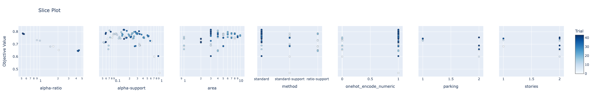
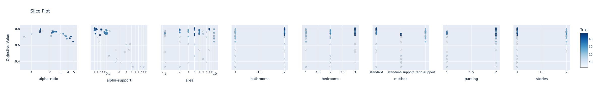
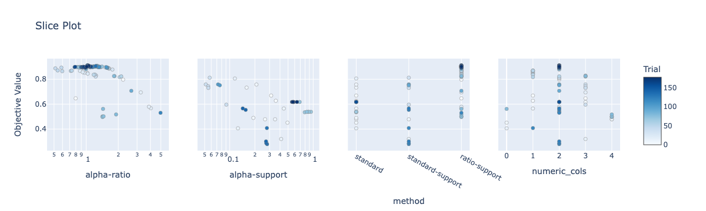
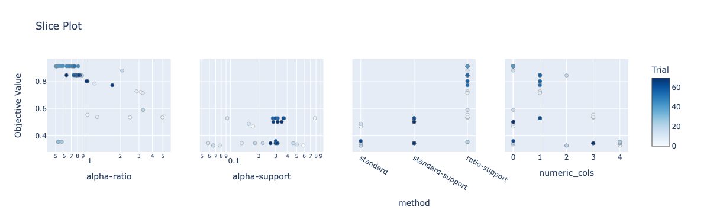
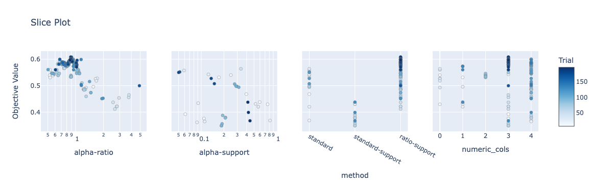
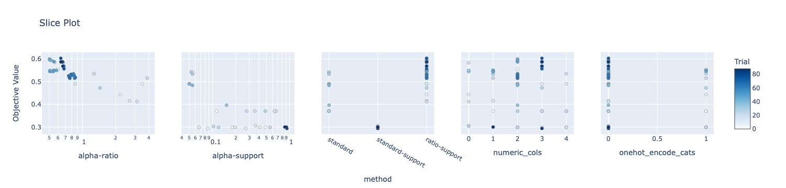

# Formal Concept Analysis HW

By: Khomyakov Anton

## Dataset sources (Kaggle):

1. [Housing Prices](https://www.kaggle.com/datasets/harishkumardatalab/housing-price-prediction)

House price prediction based on area, number of bedrooms, etc.

5 numerical features, 6 boolean feautres, 1 categorical

2. [Student Performance](https://www.kaggle.com/datasets/devansodariya/student-performance-data)

Prediction of student's preformance in exams based on the school, gender, age, family education, etc.

13 numerical features, 8 boolean feautres, 9 categorical

3. [Mobile Price Classification](https://www.kaggle.com/datasets/iabhishekofficial/mobile-price-classification)

Mobile phone price prediction based on size of ram, battery, clock_speed, etc.

14 numerical features, 6 boolean feautres, 1 categorical

## Metrics

I chose `f1_macro` as a metric for comaring the predictions as it captures recall and precision for both classes. `AUC ROC` can't be used as we can't calculate probabilities for each class.

## Classification with models from sklearn and other ML libraries

### Data preparation

Numerical attributes were tranformed using Standard Sclaer from sklearn. Boolean and Categorical attributes were one-hot encoded.

### Models used with params

Best parameters were chosen using param grid searches using GridSearchCV. The parameters were picked from most freqently ranges.

 - Naive Bayes       

    No parameters to tune.

 - Decision Tree  

```python
param_grid =  {
    'criterion': ['gini','entropy'],
    'splitter': ['best'],
    'max_depth': [3, 10, 20, 25],
    'max_features': ['sqrt', 3, 5, 10],
    'min_samples_leaf': [2, 3, 5],
    'min_samples_split': [2, 3, 5]
}
```
 - Random Forest      

```python
param_grid =  {
    'n_estimators': [100, 200, 500],
    'criterion':['gini','entropy'],
    'bootstrap': [True],
    'max_depth': [10, 20, 25],
    'max_features': ['sqrt', 3, 10],
    'min_samples_leaf': [2, 3],
    'min_samples_split': [2, 3]
}
```

 - Logistic Regression

```python
param_grid = {
    'max_iter' : [100, 500],
    'penalty' : ['l2'], 
    'C' : np.logspace(-4, 4, 10),
    'solver' : ['lbfgs', 'liblinear']
}
```

 - K Nearest Neighbors

```python
param_grid = {
    'n_neighbors' : [1, 3, 5, 10, 50, 100],
    'weights' : ['uniform', 'distance'],
    'algorithm' : ['auto', 'ball_tree','kd_tree'],
    'p' : [1, 2]
}
```

 - Catboost         

```python
param_grid = {
    'learning_rate': [0.001, 0.01],
    'depth': [5, 10],
    'min_child_samples': [2, 5],
    'iterations': [100],
    'logging_level': ['Silent'],
}
```

 - Xgboost    

```python
param_grid = {
    'n_estimators': [100], 
    'colsample_bytree': [0.75,0.8,0.85],
    'max_depth': [None],
    'reg_alpha': [1],
    'reg_lambda': [2, 5, 10],
    'subsample': [0.55, 0.6, .65],
    'learning_rate':[0.5],
    'gamma':[.5,1,2],
    'min_child_weight':[0.01],
    'sampling_method': ['uniform']
}
```    

### Code

Data perparation and classification using sklearn, xgboost and CatBoost can be found in the notebook 

[LazyFCA-sklearn-xgb-catboost.ipynb](LazyFCA-sklearn-xgb-catboost.ipynb)

## LazyFCA classification

## Data Preparation

The mobile price dataset is downsampled to 512 objects (in pandas: `df.sample(512, random_state=42)`) to speed the calculations up

For datasets with a prediciton task, the target is binnized using `pd.qcut(..., 2)`.

Boolean values encoded with strings or other were replaced by 0 and 1.

## Parameter tuning

I tuned the alpha parameter for all three binary_decision_functions.

For `standard` and `starndard-support` I chose the search range $ [0, 0.25] $

For `ratio-support` I chose the search range $ [0.1, 5.0] $

Parameter tuning concerned also binarization of data:

- Binning with a parameter of number of bins (Using quantiles)

- One-hot encoding with a parameter of subset of attributes

- Ordinal Encoding with a parameter of subset of attributes

For FCA parameter tuning was done using `optuna`.

## Code

The code for cross-validation using this metric and grid search implementation can be found in `fca_utils.py`

Data preparation and param tuning for binary and pattern classifiers can be found in the notebooks:

1. [LazyFCA-housing.ipynb](housing-price-prediction/LazyFCA-housing.ipynb)
2. [LazyFCA-mobile.ipynb](mobile-price-classification/LazyFCA-mobile.ipynb)
3. [LazyFCA-students.ipynb](student-performance-data/LazyFCA-students.ipynb)

## Results table

The comparison between these methods for the best parameters found (cross-validation results):

|    | classifier          |   f1_macro_mobile |   f1_macro_housing |   f1_macro_student |
|---:|:--------------------|------------------:|-------------------:|-------------------:|
|  0 | Naive Bayes         |          0.931 |           0.784 |           0.597 |
|  1 | Decision Tree       |          0.920 |           0.723 |           0.487 |
|  2 | Random Forest       |          0.953 |           0.752 |           0.559 |
|  3 | Logistic Regression |      **0.992** |           0.784 |           0.529 |
|  4 | K Nearest Neighbors |          0.930 |           0.750 |           0.565 |
|  5 | Catboost            |          0.929 |           0.747 |           0.543  |
|  6 | Xgboost             |          0.963 |           0.778 |           0.600 |
|  7 | Binary Classifier   |          0.911 |           **0.817** |          **0.608** |
|  8 | Pattern Classifier  |          0.915 |       0.808 |       0.603 |

So, the binary classifier gave the best results for 2 of the datasets - Housing and Student.

For the Mobile and Student datasets the most important intersections counts for patterns are in the range 4-6, which probably means that the objects contain too many columns and the algorithm overfits on less likely combinations. 

The Housing dataset gives the biggest jump in performance when using FCA relative to other datasets.

The Mobile dataset is best classified by a simple Logistic Regression.

The results 

## Parameter importances

#### Housing dataset





#### Mobile dataset





#### Students dataset




